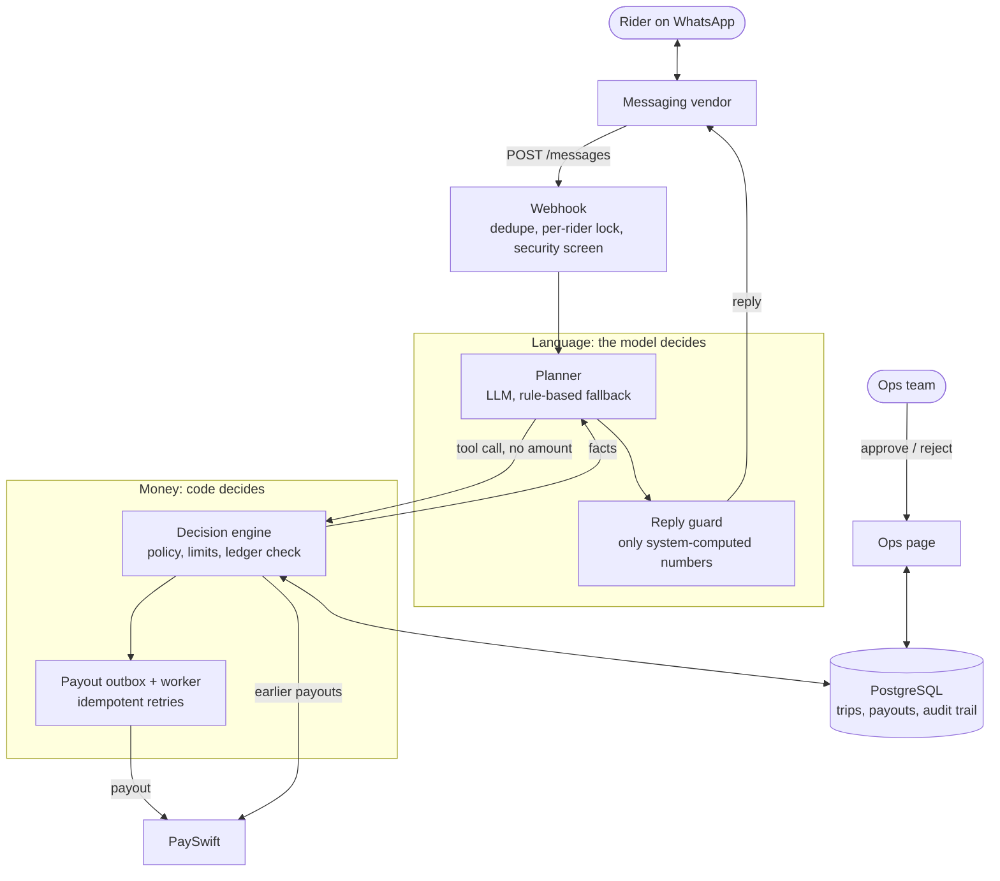
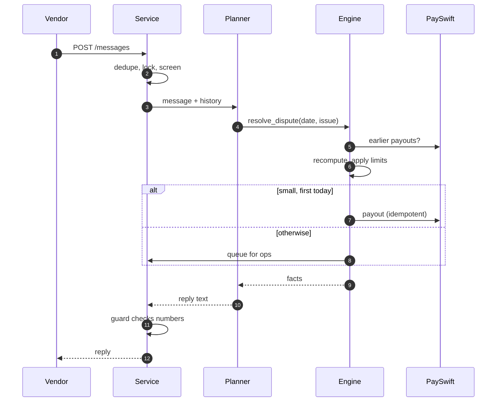
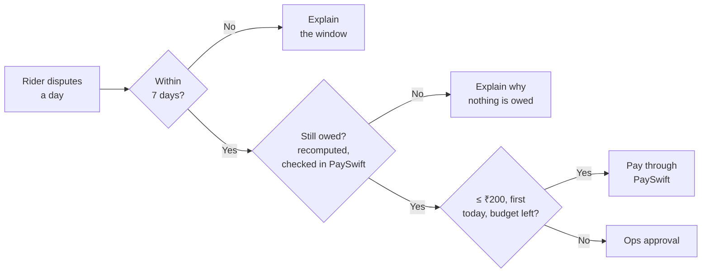
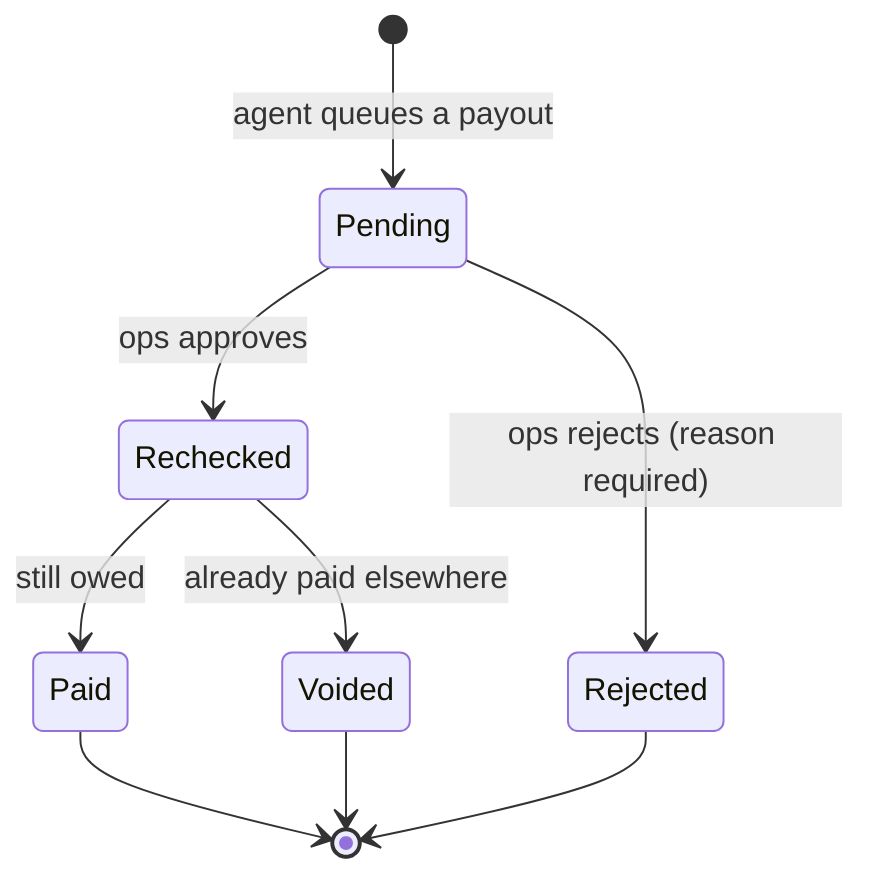

# Rider Payout Dispute Desk

An AI agent that settles QuickDrop riders' WhatsApp payout complaints end to end. It recomputes what each rider was owed, pays small corrections through PaySwift, and sends everything else to an ops page with a full audit trail.

| Main eval suite | Never overpaid | Automated tests | Reply time (p95) |
|:---:|:---:|:---:|:---:|
| **40 / 40** | **61 / 61** cases | **101** | **< 3 s** (vendor limit 10 s) |

## How to run it

```bash
cp .env.example .env          # set OPS_TOKEN; optional: LLM_PROVIDER, LLM_API_KEY
docker compose up --build     # app :8000, Postgres, PaySwift sandbox :8081
```

| What | Where / command |
|---|---|
| Ops page | http://localhost:8000/ops (sign in with `OPS_TOKEN`) |
| Health check | http://localhost:8000/health |
| Evals (one line) | `python evals/run.py http://localhost:8000 --reset-cmd "docker compose down -v && docker compose up -d --wait"` |
| Tests | `pip install -r requirements-dev.txt && pytest` (needs Postgres on :5432) |
| CI | GitHub Actions runs lint, tests and all eval suites on every push |

## Architecture

**The model handles language; code holds the money.** The LLM never sees or passes an amount. Its only route to money is a tool whose amount the engine computes.



| The model decides | Code decides |
|---|---|
| What the rider means (Hinglish, English, Devanagari, across messages) | Who the rider is (from the vendor, never the model) |
| Which tool to call, what to ask, when to escalate | What is owed: each IST day recomputed from policy |
| The wording of the reply | Whether money moves, how much, and through which path |

### Agent tools

All tools are bound to the sender's `rider_id`.

| Tool | What it does |
|---|---|
| `lookup_trip(trip_id)` | Reads one of the rider's own trips; another rider's trip reads as "not on your account" |
| `review_day(date)` | Read-only recomputation of one IST day |
| `resolve_dispute(date, issue, trip_ids?)` | **The only path to money.** Takes no amount; the engine decides, then pays or queues |
| `case_status()` | Payouts and approvals so far, for "when will I get it?" |
| `escalate_to_ops(category, reason)` | Hands the case to a person with context |

## Workflow: life of a message



- **Duplicates:** a vendor retry with the same `message_id` gets the stored reply; the agent never runs twice.
- **Ordering:** one rider's messages are handled one at a time, in order.
- **Speed:** slow payouts finish in the background, so the reply still arrives in about 3 seconds.

## Workflow: how money is decided



- **Never more than owed:** only uncovered item shortfalls are paid, capped by the day's net total, with earlier payouts read from **PaySwift's ledger**.
- **No double payments:** each payout is saved before PaySwift is called, and its id is the idempotency key, so retries are byte-identical. Lost responses are found in the ledger.
- **Limits:** "once per rider per day" is a database constraint, and a daily budget caps automatic payouts across all riders.
- **Shadow mode** (`AUTO_PAY_MODE=shadow`): the agent decides, ops approves every payout, and the page shows the agreement rate. This is a way to *trust it before it moves money*.

## Workflow: ops approvals and escalations



Approvals are re-checked against the trips and PaySwift before paying, and a rejected item is never raised again.

Escalations go to ops for:
- records the rider still disputes after a re-check;
- distance disputes;
- penalty-waiver requests;
- another rider's order;
- shortfalls older than 7 days;
- suspicious messages;
- requests for a person;
- payouts PaySwift can't complete.

Each escalation shows what to do next.

## Safety and reliability

| Risk | Protection |
|---|---|
| Rider impersonates another, or tries prompt injection | Caught by code **before** the LLM; fixed refusal plus escalation |
| LLM invents an amount or a payment | Reply guard: only system-computed numbers; must mention money moved; can't claim an unpaid payment |
| LLM is down or misconfigured | Rule-based planner takes over; the ops page shows why |
| PaySwift fails, stalls or loses responses | Idempotent retries, ledger check, background worker, escalation if stuck |
| PaySwift rate limit (30 POSTs / 10 s) | Client-side limit of 20 / 10 s with global back-off |
| Burst of riders, duplicate deliveries | Per-rider lock, bounded concurrency, message de-duplication |
| Message flood | Rider paused after 30 messages an hour |
| Secrets and access | API keys redacted from the audit trail; ops page and API need a token |

Every step is recorded at `GET /trace/{rider_id}` and shown on the ops page as a plain-language timeline. Pending items are at `GET /ops/pending`. An **Insights** view shows:
- how many riders were settled without a person;
- where the money went;
- what the payout system keeps getting wrong.

## Assumptions

- **Exports are normalised on load:** `R7`/`r19` become `R007`/`R019`, 10 duplicated trip rows are dropped, and integer distances ≥ 100 are metres (this reproduces what was actually paid).
- **Dates:** "today" is the IST date of `received_at`, the 7-day window is inclusive, and a dispute is one rider plus one IST day.
- **Once per day** limits *automatic* payouts; ops-approved ones don't use it up.
- **Vague complaints** get a clarifying question before anything is paid.
- **One app instance** is assumed (the rate limiter and payout worker are per process).

## Eval results

`evals/run.py` uses only the public API and PaySwift, so it runs against any implementation. It measures money in PaySwift's ledger and gives each conversation a fresh system; a rider with history is reported as skipped, never as passed. All runs use the rules planner with PaySwift fault injection on.

| Suite | Correct | Never overpaid |
|---|:---:|:---:|
| Main: 24 samples + 16 of mine | **40/40** | 40/40 |
| Hard: Devanagari, typos, number words, story changes | **14/14** (9/14 before parser fixes, so no longer held out) | 14/14 |
| Held-out: written after those fixes, run once | **5/7** | 7/7 |

Every miss was safe: the agent asked for the date instead of guessing.

Also verified:
- 19 concurrent riders were each paid exactly once.
- A 20-second PaySwift outage recovered with one payout.
- The ops page was driven end to end in a headless browser (`tests/ui`).

## What I skipped

- **Live-LLM eval numbers.** The LLM path is covered by scripted-model tests; run the suites with a key to compare it with the rules planner.
- **Notifying riders after an ops decision.** The vendor interface is reply-only.
- **Production extras:** multi-instance coordination, ops SSO and roles, clawback of overpayments, data retention.

## Repository layout

| Path | Contents |
|---|---|
| `app/domain/` | Payout policy, data loading, day statements, decision engine |
| `app/agent/` | Message handling, tools, LLM planner and reply guard, rule-based planner |
| `app/payouts.py`, `app/payswift.py` | Payout execution, approvals, reconciliation; PaySwift client |
| `app/main.py`, `app/static/` | HTTP API and the ops page |
| `evals/` | Eval runner plus main, hard and held-out suites |
| `tests/` | Unit, integration and API tests; browser checks in `tests/ui` |
| `ai-logs/` | Raw exports of the AI sessions used to build this |